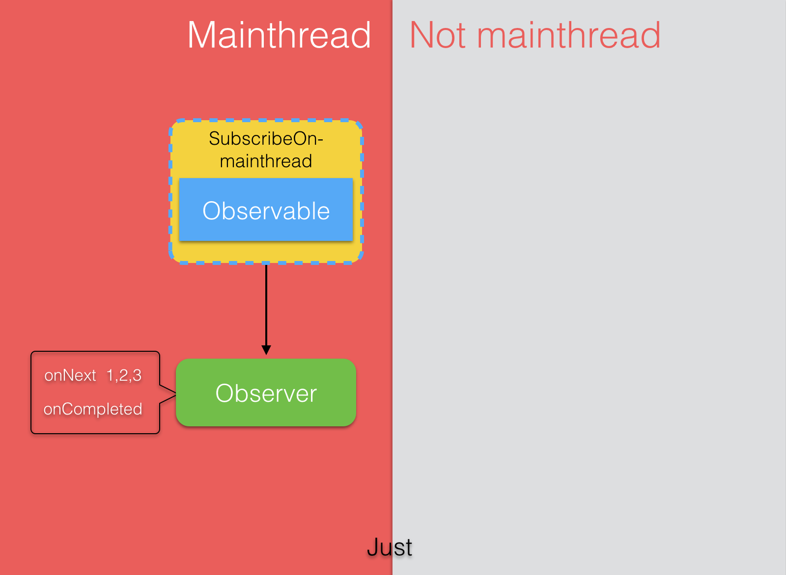
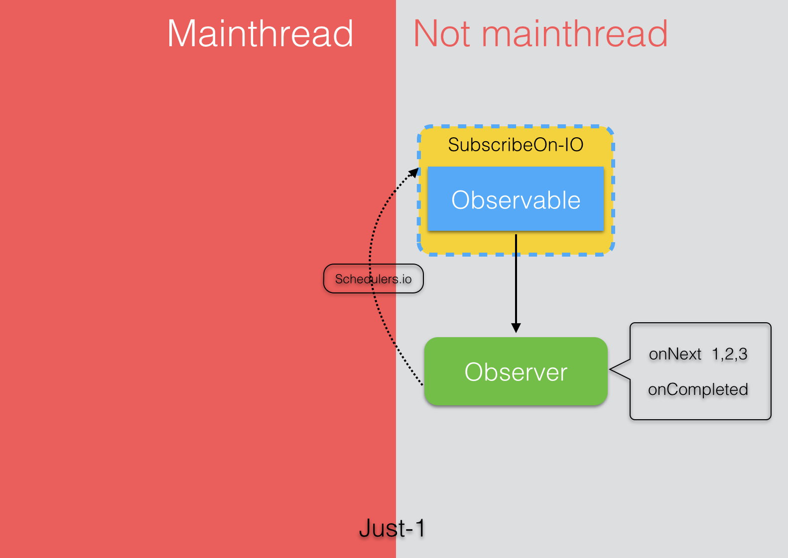
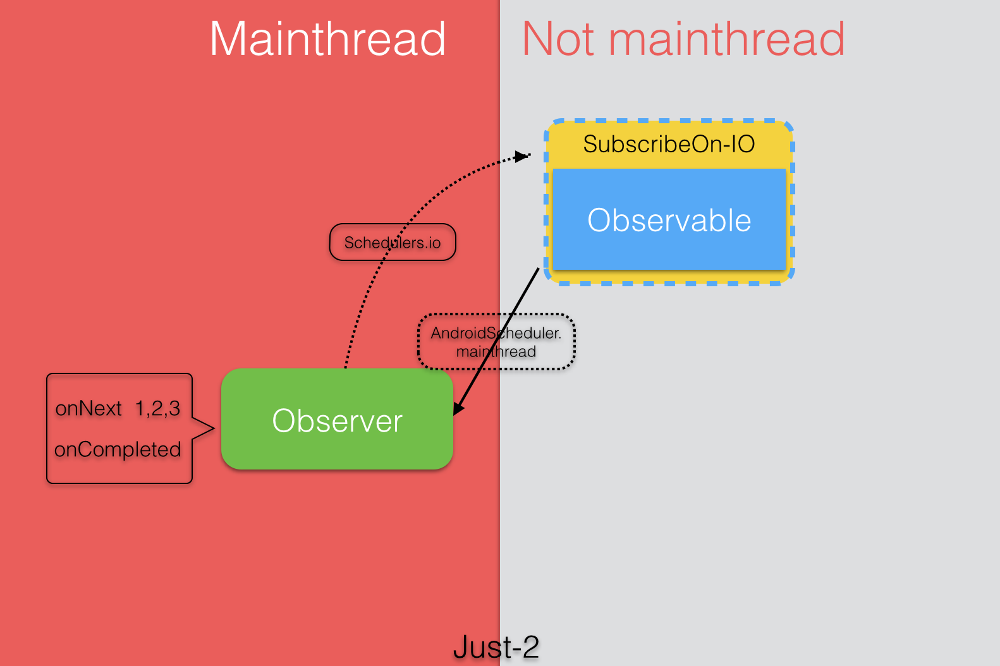
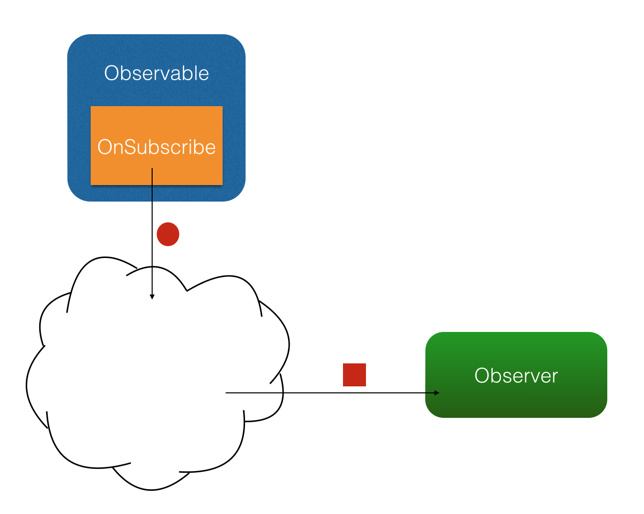
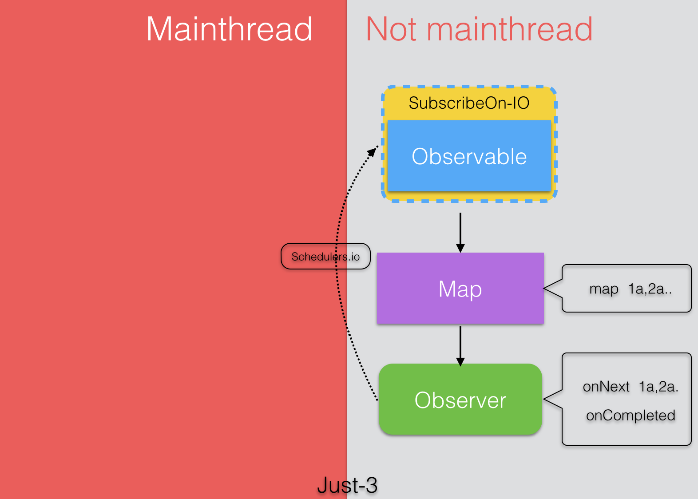
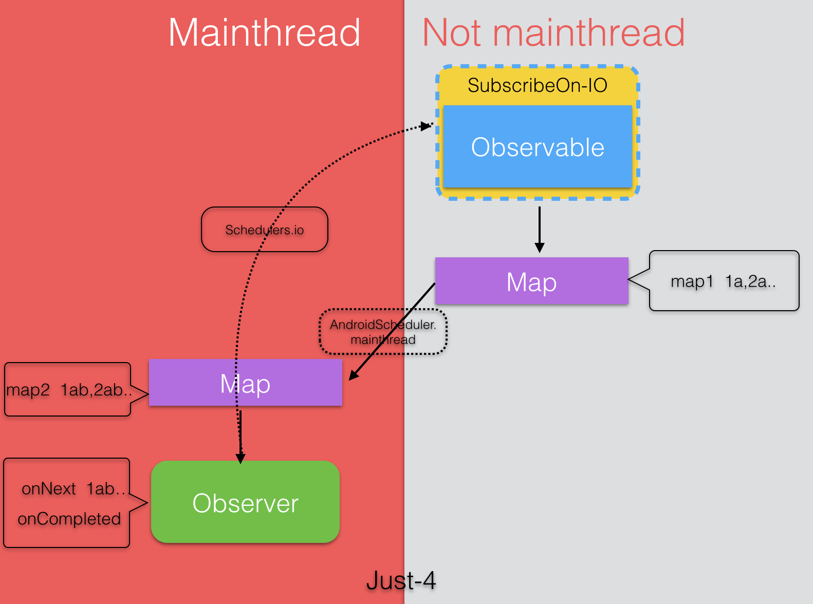
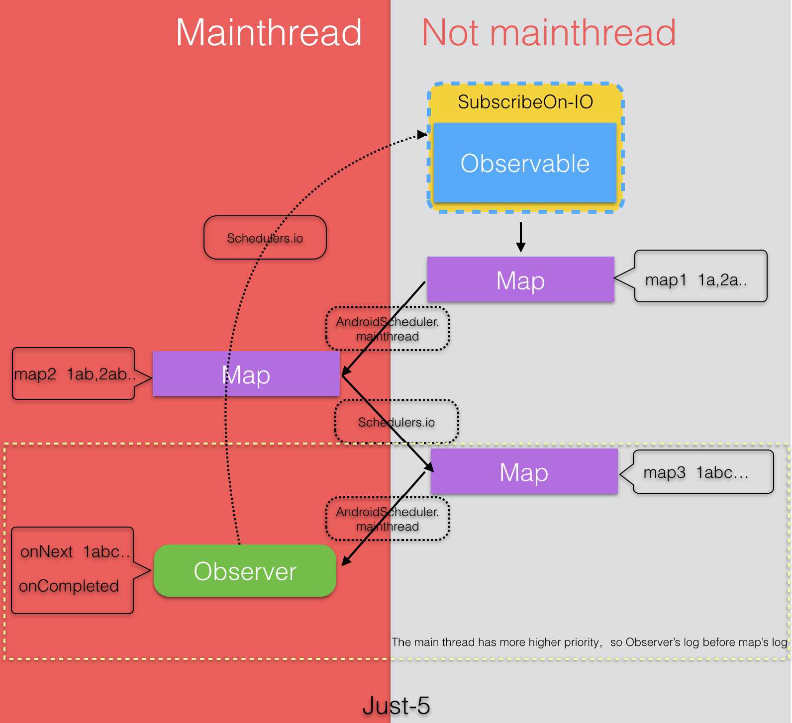

[TOC]

# RxJava 

## 1. 观察者模式

观察者模式面向的需求是：A 对象（观察者）对 B 对象（被观察者）的某种变化高度敏感，需要在 B 变化的一瞬间做出反应。

在程序中，观察者多是采用注册(**Register**)或者称为订阅**(Subscribe)**的方式，告诉被观察者：我需要你的某某状态，你要在它变化的时候通知我。Android 开发中一个比较典型的例子是点击监听器 `OnClickListener`。

OnClickListener 的模式大致如下图：


通过 `setOnClickListener()` 方法，`Button` 持有 `OnClickListener` 的引用；当用户点击时，`Button` 自动调用 `OnClickListener` 的 `onClick()` 方法。

把这张图中的概念抽象出来（`Button` -> 被观察者、`OnClickListener` -> 观察者、`setOnClickListener()` -> 订阅，`onClick()` -> 事件），就由专用的观察者模式（例如只用于监听控件点击）转变成了通用的观察者模式。如下图：


RxJava 作为一个工具库，使用的就是通用形式的观察者模式。

## 2. 四个基本概念

- `Observable` 可观察者，即被观察者

- `Observer` 观察者

- `subscribe` 订阅

- `事件`

  `Observable` 和 `Observer` 通过 `subscribe()` 方法实现订阅关系，从而 `Observable` 可以在需要的时候发出事件来通知 `Observer`。

## 3. 三个重要回调

与传统观察者模式不同，RxJava 的事件回调方法除了普通事件 `onNext()` （相当于 `onClick()` / `onEvent()`）之外，还定义了两个特殊的事件：`onCompleted()` 和 `onError()`。

- onNext()：相当于onClick() 事件
- onCompleted：事件队列完结。RxJava 不仅把每个事件单独处理，还会把它们看做一个队列。RxJava 规定，当不会再有新的 `onNext()` 发出时，需要触发 `onCompleted()` 方法作为标志。
- onError：事件队列异常。在事件处理过程中出异常时，`onError()` 会被触发，同时队列自动终止，不允许再有事件发出。

> 在一个正确运行的事件序列中, `onCompleted()` 和 `onError()` 有且只有一个，并且是事件序列中的最后一个。需要注意的是，`onCompleted()` 和 `onError()` 二者也是互斥的，即在队列中调用了其中一个，就不应该再调用另一个。

RxJava 的观察者模式大致如下图：


## 4. 基本用法

### 1> 创建 Observer 监听器

Observer 即观察者，它决定事件触发的时候将有怎样的行为。 RxJava 中的 `Observer` 接口的实现方式：

```java
Observer<String> observer = new Observer<String>() {
    @Override
    public void onNext(String s) {
        Log.d(tag, "Item: " + s);
    }

    @Override
    public void onCompleted() {
        Log.d(tag, "Completed!");
    }

    @Override
    public void onError(Throwable e) {
        Log.d(tag, "Error!");
    }
};
```

除了 `Observer` 接口之外，RxJava 还内置了一个实现了 `Observer` 的抽象类：`Subscriber`。 `Subscriber` 对 `Observer` 接口进行了一些扩展，但他们的基本使用方式是完全一样的：

```java
Subscriber<String> subscriber = new Subscriber<String>() {
    @Override
    public void onNext(String s) {
        Log.d(tag, "Item: " + s);
    }

    @Override
    public void onCompleted() {
        Log.d(tag, "Completed!");
    }

    @Override
    public void onError(Throwable e) {
        Log.d(tag, "Error!");
    }
};
```

> 不仅基本使用方式一样，实质上，在 RxJava 的 subscribe 过程中，`Observer` 也总是会先被转换成一个 `Subscriber` 再使用。如果只是想使用基本功能，选择 `Observer` 和 `Subscriber` 是完全一样的。

**它们的区别：**

1. `onStart()`: 这是 `Subscriber` 增加的方法。它会在 subscribe 刚开始，而事件还未发送之前被调用，可以用于做一些准备工作，例如数据的清零或重置。这是一个可选方法，默认情况下它的实现为空。

   **需要注意的是，如果对准备工作的线程有要求（例如弹出一个显示进度的对话框，这必须在主线程执行）， `onStart()` 就不适用了。**因为它总是在 subscribe 所发生的线程被调用，而不能指定线程。要在指定的线程来做准备工作，可以使用 `doOnSubscribe()` 方法。

2. `unsubscribe()`: 这是 `Subscriber` 所实现的另一个接口 `Subscription` 的方法，用于取消订阅。在这个方法被调用后，`Subscriber` 将不再接收事件。一般在这个方法调用前，可以使用 `isUnsubscribed()` 先判断一下状态。

    `subscribe()` 之后， `Observable` 会持有 `Subscriber` 的引用，这个引用如果不能及时被释放，将有内存泄露的风险。

    **原则：要在不再使用的时候尽快在合适的地方（例如 `onPause()` `onStop()` 等方法中）调用 `unsubscribe()` 来解除引用关系，以避免内存泄露的发生。**

### 2>  创建 Observable

Observable 即被观察者，它决定什么时候触发事件以及触发怎样的事件。 RxJava 使用 `create()` 方法来创建一个 Observable ，并为它定义事件触发规则：

```java
Observable observable = Observable.create(new Observable.OnSubscribe<String>() {
  	// 当 observable 被订阅的时候，call() 方法被触发
    @Override
    public void call(Subscriber<? super String> subscriber) {
      	// 此处模拟触发的事件
        subscriber.onNext("Hello");
        subscriber.onNext("Hi");
        subscriber.onNext("RxJava");
        subscriber.onCompleted();
    }
});
```

这里传入了一个 `OnSubscribe` 对象作为参数。`OnSubscribe` 会被存储在返回的 `Observable`对象中，它的作用相当于一个计划表，当 `Observable` 被订阅的时候，`OnSubscribe` 的 `call()` 方法会自动被调用，事件序列就会依照设定依次触发（对于上面的代码，就是观察者`Subscriber` 将会被调用三次 `onNext()` 和一次 `onCompleted()`）。这样，由被观察者调用了观察者的回调方法，就实现了由被观察者向观察者的事件传递，即观察者模式。

`create()` 方法是 RxJava 最基本的创造事件序列的方法。基于这个方法， RxJava 还提供了一些方法用来快捷创建事件队列，例如：

- `just(T...)`: 将传入的参数依次发送出来。

  ```java
  Observable observable = Observable.just("Hello", "Hi", "RxJava");
  // 将会依次调用：
  // onNext("Hello");
  // onNext("Hi");
  // onNext("RxJava");
  // onCompleted();
  ```

- `from(T[])` / `from(Iterable<? extends T>)` : 将传入的数组或 `Iterable` 拆分成具体对象后，依次发送出来。

  ```java
  String[] words = {"Hello", "Hi", "RxJava"};
  Observable observable = Observable.from(words);
  // 将会依次调用：
  // onNext("Hello");
  // onNext("Hi");
  // onNext("RxJava");
  // onCompleted();
  ```

  上面 `just(T...)` 的例子和 `from(T[])` 的例子，都和之前的 `create(OnSubscribe)` 的例子是等价的。

### 3>  Subscribe (订阅)

创建了 `Observable` 和 `Observer` 之后，再用 `subscribe()` 方法将它们联结起来，整条链子就可以工作了。代码形式很简单：

```java
observable.subscribe(observer);
// 或者：
observable.subscribe(subscriber);
```

`Observable.subscribe(Subscriber)` 的内部实现是这样的（仅核心代码）：

```java
// 注意：这不是 subscribe() 的源码，而是将源码中与性能、兼容性、扩展性有关的代码剔除后的核心代码。
// 如果需要看源码，可以去 RxJava 的 GitHub 仓库下载。
public Subscription subscribe(Subscriber subscriber) {
    subscriber.onStart();
    onSubscribe.call(subscriber);
    return subscriber;
}
```

可以看到，`subscriber()` 做了3件事：

1. 调用 `Subscriber.onStart()` 。这个方法在前面已经介绍过，是一个可选的准备方法。
2. 调用 `Observable` 中的 `OnSubscribe.call(Subscriber)` 。在这里，事件发送的逻辑开始运行。从这也可以看出，在 RxJava 中， `Observable` 并不是在创建的时候就立即开始发送事件，而是在它被订阅的时候，即当 `subscribe()` 方法执行的时候。
3. 将传入的 `Subscriber` 作为 `Subscription` 返回。这是为了方便 `unsubscribe()`.

整个过程中对象间的关系如下图：


动图是这个样子：


除了 `subscribe(Observer)` 和 `subscribe(Subscriber)` ，`subscribe()` 还支持不完整定义的回调（只实现on

Next()/onError()/onCompleted()中的某一个回调），RxJava 会自动根据定义创建出 `Subscriber` 。形式如下：

```javascript
Action1<String> onNextAction = new Action1<String>() {
    // onNext()
    @Override
    public void call(String s) {
        Log.d(tag, s);
    }
};
Action1<Throwable> onErrorAction = new Action1<Throwable>() {
    // onError()
    @Override
    public void call(Throwable throwable) {
        // Error handling
    }
};
Action0 onCompletedAction = new Action0() {
    // onCompleted()
    @Override
    public void call() {
        Log.d(tag, "completed");
    }
};

// 自动创建 Subscriber ，并使用 onNextAction 来定义 onNext()
observable.subscribe(onNextAction);
// 自动创建 Subscriber ，并使用 onNextAction 和 onErrorAction 来定义 onNext() 和 onError()
observable.subscribe(onNextAction, onErrorAction);
// 自动创建 Subscriber ，并使用 onNextAction、 onErrorAction 和 onCompletedAction 来定义 onNext()、 onError() 和 onCompleted()
observable.subscribe(onNextAction, onErrorAction, onCompletedAction);
```

 `Action0` 是 RxJava 的一个接口，它只有一个方法 `call()`，这个方法是无参无返回值的；由于 `onCompleted()` 方法也是无参无返回值的，因此 `Action0` 可以被当成一个包装对象，将 `onCompleted()` 的内容打包起来将自己作为一个参数传入 `subscribe()` 以实现不完整定义的回调。这样其实也可以看做将 `onCompleted()` 方法作为参数传进了 `subscribe()`，相当于其他某些语言中的『闭包』。

`Action1` 也是一个接口，它同样只有一个方法 `call(T param)`，这个方法也无返回值，但有一个参数；与 `Action0` 同理，由于 `onNext(T obj)` 和 `onError(Throwable error)` 也是单参数无返回值的，因此 `Action1` 可以将 `onNext(obj)` 和 `onError(error)` 打包起来传入 `subscribe()` 以实现不完整定义的回调。

事实上，虽然 `Action0` 和 `Action1` 在 API 中使用最广泛，但 RxJava 是提供了多个 `ActionX` 形式的接口 (例如 `Action2`, `Action3`) 的，它们可以被用以包装不同的无返回值的方法。

## 5. RxJava 简单示例

### 1> 打印输出数组

```java
String[] names = {"Hello", "Hi", "RxJava"};
Observable.from(names)
                .subscribe(new Action1<String>() {
                  	// 入参 相关于 onNext()
                    @Override
                    public void call(String s) {
                        printLog(s);
                    }
                });
```

### 2> 由 id 取得图片并显示

由指定的一个 drawable 文件 id `drawableRes` 取得图片，并显示在 `ImageView` 中，并在出现异常的时候打印 Toast 报错

```java
// drawableRes 为图像资源id
int drawableRes; 
// 图片显示的 View
ImageView imageView;

Observable.create(new OnSubscribe<Drawable>() {
    @Override
    public void call(Subscriber<? super Drawable> subscriber) {
        Drawable drawable = getTheme().getDrawable(drawableRes));
      
        subscriber.onNext(drawable);
        subscriber.onCompleted();
    }
}).subscribe(new Observer<Drawable>() {
    @Override
    public void onNext(Drawable drawable) {
        imageView.setImageDrawable(drawable);
    }

    @Override
    public void onCompleted() {
    }

    @Override
    public void onError(Throwable e) {
        Toast.makeText(activity, "Error!", Toast.LENGTH_SHORT).show();
    }
});
```

> RxJava 的默认规则中，事件的发出和消费都是在同一个线程的。

如果只是按上面使用 RxJava 接口，实现出来的只是一个同步的观察者模式。

观察者模式本身的目的就是『后台处理，前台回调』的异步机制，因此异步对于 RxJava 是至关重要的。而要实现异步，则需要用到 RxJava 的另一个概念： `Scheduler` 。

## 6. Scheduler  线程控制

在不指定线程的情况下， RxJava 遵循的是线程不变的原则，即：在哪个线程调用 `subscribe()`，就在哪个线程生产事件；在哪个线程生产事件，就在哪个线程消费事件。如果需要切换线程，就需要用到 `Scheduler` （调度器）。

### 1> 五种类型

在RxJava 中，`Scheduler` 调度器，相当于线程控制器，RxJava 通过它来指定每一段代码应该运行在什么样的线程。RxJava 已经内置了几个 `Scheduler` ，它们已经适合大多数的使用场景：

- `Schedulers.immediate()`: 直接在当前线程运行，相当于不指定线程。这是默认的 `Scheduler`。

- `Schedulers.newThread()`: 总是启用新线程，并在新线程执行操作。

- `Schedulers.io()`: I/O 操作（读写文件、读写数据库、网络信息交互等）所使用的 `Scheduler`。

  行为模式和 `newThread()` 差不多，区别在于 `io()` 的内部实现是是用一个无数量上限的线程池，可以重用空闲的线程，因此多数情况下 `io()` 比 `newThread()` 更有效率。不要把计算工作放在 `io()` 中，可以避免创建不必要的线程。

- `Schedulers.computation()`: 计算所使用的 `Scheduler`。

  这个计算指的是 CPU 密集型计算，即不会被 I/O 等操作限制性能的操作，例如图形的计算。这个 `Scheduler` 使用的固定的线程池，大小为 CPU 核数。不要把 I/O 操作放在 `computation()` 中，否则 I/O 操作的等待时间会浪费 CPU。

- Android 专用的 `AndroidSchedulers.mainThread()`，它指定的操作将在 Android 主线程运行。

有了这几个 `Scheduler` ，就可以使用 `subscribeOn()` 和 `observeOn()` 两个方法来对线程进行控制：

#### (1) subscribeOn

指定 `subscribe()` 所发生的线程，即 `Observable.OnSubscribe` 被激活时所处的线程。或者叫做事件产生的线程。 

#### (2) observeOn()

指定 `Subscriber` 所运行在的线程。或者叫做事件消费的线程。

```java
Observable.just(1, 2, 3, 4)
    .subscribeOn(Schedulers.io()) // 指定 subscribe() 发生在 IO 线程
    .observeOn(AndroidSchedulers.mainThread()) // 指定 Subscriber 的回调发生在主线程
    .subscribe(new Action1<Integer>() {
        @Override
        public void call(Integer number) {
            Log.d(tag, "number:" + number);
        }
    });
```

上面这段代码中:

​	由于 `subscribeOn(Schedulers.io())` 的指定，被创建的事件的内容 `1`、`2`、`3`、`4` 将会在 IO 线程发出；

​	由于 `observeOn(AndroidScheculers.mainThread()`) 的指定，因此 `subscriber` 数字的打印将发生在主线程 。

事实上，这种在 `subscribe()` 之前写上两句 `subscribeOn(Scheduler.io())` 和 `observeOn(AndroidSchedulers.mainThread())` 的使用方式非常常见，它适用于多数的 **『后台线程取数据，主线程显示』**的程序策略。

而前面提到的由图片 id 取得图片并显示的例子，如果也加上这两句：

```java
// drawableRes 为图像资源id
int drawableRes; 
// 图片显示的 View
ImageView imageView;

Observable.create(new OnSubscribe<Drawable>() {
    @Override
    public void call(Subscriber<? super Drawable> subscriber) {
        Drawable drawable = getTheme().getDrawable(drawableRes));
      
        subscriber.onNext(drawable);
        subscriber.onCompleted();
    }
})
  .subscribeOn(Schedulers.io()) // 指定 subscribe() 发生在 IO 线程
  .observeOn(AndroidSchedulers.mainThread()) // 指定 Subscriber 的回调发生在主线程
  .subscribe(new Observer<Drawable>() {
    @Override
    public void onNext(Drawable drawable) {
        imageView.setImageDrawable(drawable);
    }

    @Override
    public void onCompleted() {
    }

    @Override
    public void onError(Throwable e) {
        Toast.makeText(activity, "Error!", Toast.LENGTH_SHORT).show();
    }
});
```

那么，加载图片将会发生在 IO 线程，而设置图片则被设定在了主线程。这就意味着，即使加载图片耗费了几十甚至几百毫秒的时间，也不会造成丝毫界面的卡顿。

### 2> Scheduler 简单示例

#### (1) 默认指定

> 生产消费线程都没有指定，所以都是发生在 Main 线程中；

```java
    private void doJust() {
        Observable.just(1, 2, 3)
                .subscribe(new Subscriber<Integer>() {
                    @Override
                    public void onCompleted() {
                        printLog("Completed");
                    }

                    @Override
                    public void onError(Throwable e) {
                        printLog("onError");
                    }

                    @Override
                    public void onNext(Integer integer) {
                        printLog("Next " + integer + " ");
                    }
                });
    }
```

```bash
11-04 10:20:31.884 3671-3671/ I/SchedulerFragment: Next 1  [MainThread]
11-04 10:20:31.885 3671-3671/ I/SchedulerFragment: Next 2  [MainThread]
11-04 10:20:31.886 3671-3671/ I/SchedulerFragment: Next 3  [MainThread]
11-04 10:20:31.886 3671-3671/ I/SchedulerFragment: Completed [MainThread]
```




#### (2) subscribeOn

此处必须注意：

> 如果只是指定了 subscribeOn 事件生产的线程，那么事件消费的线程同事件生产的线程一致。

```java
    /**
     * subscribeOn 事件产生的线程在 IO 线程
     * 由于没有指定 消费线程
     * 所以事件消费的线程跟事件产生的线程一致，此处也就是 IO 线程
     */
    private void doJustOne() {
        Observable.just(1, 2, 3)
                .subscribeOn(Schedulers.io())
                .subscribe(new Subscriber<Integer>() {
                    @Override
                    public void onCompleted() {
                        printLog("Completed");
                    }

                    @Override
                    public void onError(Throwable e) {
                        printLog("onError");
                    }

                    @Override
                    public void onNext(Integer integer) {
                        printLog("Next " + integer + " ");
                    }
                });
    }
```

```bash
11-04 10:20:00.204 3671-18421/ I/SchedulerFragment: Next 1  [- Not MainThread]
11-04 10:20:00.206 3671-18421/ I/SchedulerFragment: Next 2  [- Not MainThread]
11-04 10:20:00.206 3671-18421/ I/SchedulerFragment: Next 3  [- Not MainThread]
11-04 10:20:00.207 3671-18421/ I/SchedulerFragment: Completed [- Not MainThread]
```




#### (3) subscribeOn + observeOn

```java
    /**
     * subscribeOn 事件产生的线程在 IO 线程
     * observeOn 事件消费的线程在 Main 线程
     */
    private void doJustTwo() {
        Observable.just(1, 2, 3)
                .subscribeOn(Schedulers.io())
                .observeOn(AndroidSchedulers.mainThread())
                .subscribe(new Subscriber<Integer>() {
                    @Override
                    public void onCompleted() {
                        printLog("Completed");
                    }

                    @Override
                    public void onError(Throwable e) {
                        printLog("onError");
                    }

                    @Override
                    public void onNext(Integer integer) {
                        printLog("Next " + integer + " ");
                    }
                });
    }
```

```bash
11-04 10:19:28.925 3671-3671/ I/SchedulerFragment: Next 1  [MainThread]
11-04 10:19:28.926 3671-3671/ I/SchedulerFragment: Next 2  [MainThread]
11-04 10:19:28.926 3671-3671/ I/SchedulerFragment: Next 3  [MainThread]
11-04 10:19:28.926 3671-3671/ I/SchedulerFragment: Completed [MainThread]
```



### 3> 原理

Scheduler 的原理以下一节《变换》的原理作为基础的。

## 7. 变换

RxJava 提供了对事件序列进行变换的支持，这是它的核心功能之一，也是大多数人说『RxJava 真是太好用了』的最大原因。

**所谓变换，就是将事件序列中的对象或整个序列进行加工处理，转换成不同的事件或事件序列。**

### 1> API 介绍

```java
Observable.just("images/logo.png") // 输入类型 String
    .map(new Func1<String, Bitmap>() {
        @Override
        public Bitmap call(String filePath) { // 参数类型 String
            return getBitmapFromPath(filePath); // 返回类型 Bitmap
        }
    })
    .subscribe(new Action1<Bitmap>() {
        @Override
        public void call(Bitmap bitmap) { // 参数类型 Bitmap
            showBitmap(bitmap);
        }
    });
```

这里出现了一个叫做 `Func1` 的类。它和 `Action1` 非常相似，也是 RxJava 的一个接口，用于包装含有一个参数的方法。 `Func1` 和 `Action` 的区别在于， `Func1` 包装的是有返回值的方法。另外，和 `ActionX` 一样， `FuncX` 也有多个，用于不同参数个数的方法。`FuncX` 和 `ActionX` 的区别在 `FuncX` 包装的是有返回值的方法。

示例中，`map()` 方法将参数中的 `String` 对象转换成一个 `Bitmap` 对象后返回，而在经过 `map()` 方法后，事件的参数类型也由 `String` 转为了 `Bitmap`。这种直接变换对象并返回的，是最常见的也最容易理解的变换。不过 RxJava 的变换远不止这样，它不仅可以针对事件对象，还可以针对整个事件队列，这使得 RxJava 变得非常灵活。

我列举几个常用的变换：

#### (1) map()

事件对象的直接变换，比如将 String 对象转换成一个 Bitmap 对象返回，它是 RxJava 最常用的变换。

上面代码的示意图如下：



#### (2) flatMap()

这是一个很有用但**非常难理解**的变换，我们通过例子来说明。

首先假设这么一种需求：假设有一个数据结构『学生』，现在需要打印出一组学生的名字。实现方式很简单：

```java
Student[] students = ...;
Subscriber<String> subscriber = new Subscriber<String>() {
    @Override
    public void onNext(String name) {
        Log.d(tag, name);
    }
    ...
};
Observable.from(students)
    .map(new Func1<Student, String>() {
        @Override
        public String call(Student student) {
            return student.getName();
        }
    })
    .subscribe(subscriber);
```

那么再假设：如果要打印出每个学生所需要修的所有课程的名称呢？（需求的区别在于，每个学生只有一个名字，但却有多个课程。）首先可以这样实现：

```java
Student[] students = ...;
Subscriber<Student> subscriber = new Subscriber<Student>() {
    @Override
    public void onNext(Student student) {
        List<Course> courses = student.getCourses();
        for (int i = 0; i < courses.size(); i++) {
            Course course = courses.get(i);
            Log.d(tag, course.getName());
        }
    }
    ...
};
Observable.from(students)
    .subscribe(subscriber);
```

那么如果我不想在 `Subscriber` 中使用 for 循环，而是希望 `Subscriber` 中直接传入单个的 `Course` 对象呢（这对于代码复用很重要）？用 `map()` 显然是不行的，因为 `map()` 是一对一的转化，而我现在的要求是一对多的转化。那怎么才能把一个 Student 转化成多个 Course 呢？

```java
Student[] students = ...;
Subscriber<Course> subscriber = new Subscriber<Course>() {
    @Override
    public void onNext(Course course) {
        Log.d(tag, course.getName());
    }
    ...
};
Observable.from(students)
    .flatMap(new Func1<Student, Observable<Course>>() {
        @Override
        public Observable<Course> call(Student student) {
            return Observable.from(student.getCourses());
        }
    })
    .subscribe(subscriber);
```

从上面的代码可以看出， `flatMap()` 和 `map()` :

- 相同点：把传入的参数转化之后返回另一个对象。
- `flatMap()` 中返回的是个 `Observable` 对象，并且这个 `Observable` 对象并不是被直接发送到了 `Subscriber` 的回调方法中。

 `flatMap()` 的原理是这样的：

1. 使用传入的事件对象创建一个 `Observable` 对象；

2. 并不发送这个 `Observable`, 而是将它激活，于是它开始发送事件；

3. 每一个创建出来的 `Observable` 发送的事件，都被汇入同一个 `Observable` ，而这个 `Observable` 负责将这些事件统一交给 `Subscriber` 的回调方法。

这三个步骤，把事件拆成了两级，通过一组新创建的 `Observable` 将初始的对象『铺平』之后通过统一路径分发了下去。而这个『铺平』就是 `flatMap()` 所谓的 flat。

`flatMap()` 示意图：


> 扩展：由于可以在嵌套的 `Observable` 中添加异步代码， `flatMap()` 也常用于嵌套的异步操作，例如嵌套的网络请求。


### 2> Map 简单示例

该示例承接到 [例子(3)](#### (3) subscribeOn + observeOn)

#### (4) subscribeOn + map

使用 map 进行数据转换，是一对一的，实现数据 Integer -> String 的转换：在每个数据后面加‘a’

```java
    private void doJustThree() {
        Observable.just(1, 2, 3)
                .subscribeOn(Schedulers.io())
                .map(new Func1<Integer, String>() {
                    @Override
                    public String call(Integer integer) {
                        printLog("map " + integer + "a");
                        return integer + "a";
                    }
                })
                .subscribe(new Subscriber<String>() {
                    @Override
                    public void onCompleted() {
                        printLog("Completed");
                    }

                    @Override
                    public void onError(Throwable e) {
                        printLog("onError");
                    }

                    @Override
                    public void onNext(String s) {
                        printLog("Next " + s);
                    }
                });
    }
```

```bash
11-04 10:18:47.509 3671-18421/ I/SchedulerFragment: map 1a [- Not MainThread]
11-04 10:18:47.509 3671-18421/ I/SchedulerFragment: Next 1a [- Not MainThread]
11-04 10:18:47.509 3671-18421/ I/SchedulerFragment: map 2a [- Not MainThread]
11-04 10:18:47.509 3671-18421/ I/SchedulerFragment: Next 2a [- Not MainThread]
11-04 10:18:47.510 3671-18421/ I/SchedulerFragment: map 3a [- Not MainThread]
11-04 10:18:47.510 3671-18421/ I/SchedulerFragment: Next 3a [- Not MainThread]
11-04 10:18:47.510 3671-18421/ I/SchedulerFragment: Completed [- Not MainThread]
```




#### (5) subscribeOn + map + observeOn + map

- 在 IO 线程产生事件，使用Map对数据转换，在每个数据后面加‘a’；
- 然后切换到主线程，再使用Map变换，每个数据后加‘b’。

```java
    private void doJustFour() {
        Observable.just(1, 2, 3)
                .subscribeOn(Schedulers.io())
                .map(new Func1<Integer, String>() {
                    @Override
                    public String call(Integer integer) {
                        printLog("map1 " + integer + "a");
                      // 测试代码 A
//                        try {
//                            Thread.sleep(200);
//                        } catch (InterruptedException e) {
//                            e.printStackTrace();
//                        }
                        return integer + "a";
                    }
                })
          		// 此处的切换 会影响到后面的 map 数据转换所在线程
                .observeOn(AndroidSchedulers.mainThread())
                .map(new Func1<String, String>() {
                    @Override
                    public String call(String s) {
                        printLog("map2 " + s + "b ");
                        return s + "b";
                    }
                })
                .subscribe(new Subscriber<String>() {
                    @Override
                    public void onCompleted() {
                        printLog("Completed");
                    }

                    @Override
                    public void onError(Throwable e) {
                        printLog("onError");
                    }

                    @Override
                    public void onNext(String s) {
                        printLog("Next " + s);
                    }
                });
    }
```

```bash
11-04 10:17:02.226 3671-18421/I/SchedulerFragment: map1 1a [- Not MainThread]
11-04 10:17:02.226 3671-18421/I/SchedulerFragment: map1 2a [- Not MainThread]
11-04 10:17:02.227 3671-18421/I/SchedulerFragment: map1 3a [- Not MainThread]
11-04 10:17:02.241 3671-3671/I/SchedulerFragment: map2 1ab  [MainThread]
11-04 10:17:02.241 3671-3671/I/SchedulerFragment: Next 1ab [MainThread]
11-04 10:17:02.242 3671-3671/I/SchedulerFragment: map2 2ab  [MainThread]
11-04 10:17:02.242 3671-3671/I/SchedulerFragment: Next 2ab [MainThread]
11-04 10:17:02.242 3671-3671/I/SchedulerFragment: map2 3ab  [MainThread]
11-04 10:17:02.242 3671-3671/I/SchedulerFragment: Next 3ab [MainThread]
11-04 10:17:02.242 3671-3671/I/SchedulerFragment: Completed [MainThread]
```



> 涉及切线程的操作：
>
> Map 1 操作完的数据处理完一条就是将该事件丢到所切线程去处理 Map 2，而不是等 Map 1 中所有事件处理完了再去处理 Map 2

将上面的测试代码 A 打开，日志可能是这样的：

```bash
11-04 11:02:06.978 25860-26098/ I/SchedulerFragment: map1 1a [- Not MainThread]
11-04 11:02:07.179 25860-26098/ I/SchedulerFragment: map1 2a [- Not MainThread]
11-04 11:02:07.179 25860-25860/ I/SchedulerFragment: map2 1ab  [MainThread]
11-04 11:02:07.180 25860-25860/ I/SchedulerFragment: Next 1ab [MainThread]
11-04 11:02:07.380 25860-26098/ I/SchedulerFragment: map1 3a [- Not MainThread]
11-04 11:02:07.380 25860-25860/ I/SchedulerFragment: map2 2ab  [MainThread]
11-04 11:02:07.381 25860-25860/ I/SchedulerFragment: Next 2ab [MainThread]
11-04 11:02:07.581 25860-25860/ I/SchedulerFragment: map2 3ab  [MainThread]
11-04 11:02:07.583 25860-25860/ I/SchedulerFragment: Next 3ab [MainThread]
11-04 11:02:07.583 25860-25860/ I/SchedulerFragment: Completed [MainThread]
```

#### (6) subscribeOn + map + observeOn + map + observeOn + map + observeOn

- 使用 Schedulers.io() 指定被观察者产生事件的线程，使用Map对数据转换，在每个数据后面加‘a’
- 使用AndroidSchedulers.mainThread()切换到主线程，然后使用Map变换，每个数据后加‘b’
- 再用Schedulers.io()切换线程，用Map对数据加‘c’
- 使用AndroidSchedulers.mainThread()切换到主线程

> 针对 Map 消费过的事件可以被再次消费，因为可以多次通过 observeOn 来指定消费的线程；

```java
    private void doJustFive() {
        Observable.just(1, 2, 3)
                .subscribeOn(Schedulers.io())
                .map(new Func1<Integer, String>() {
                    @Override
                    public String call(Integer integer) {
                        printLog("map1 " + integer + "a");
                        return integer + "a";
                    }
                })
                .observeOn(AndroidSchedulers.mainThread())
                .map(new Func1<String, String>() {
                    @Override
                    public String call(String s) {
                        printLog("map2 " + s + "b ");
                        return s + "b";
                    }
                })
                .observeOn(Schedulers.io())
                .map(new Func1<String, String>() {
                    @Override
                    public String call(String s) {
                        printLog("map3 " + s + "c ");
                        return s + "c";
                    }
                })
                .observeOn(AndroidSchedulers.mainThread())
                .subscribe(new Subscriber<String>() {
                    @Override
                    public void onCompleted() {
                        printLog("Completed");
                    }

                    @Override
                    public void onError(Throwable e) {
                        printLog("onError");
                    }

                    @Override
                    public void onNext(String s) {
                        printLog("Next " + s);
                    }
                });
    }
```

```bash
// 该日志顺序是线程切换决定，随机的；

11-04 10:35:35.922 3671-2732/ I/SchedulerFragment: map1 1a [- Not MainThread]
11-04 10:35:35.922 3671-2732/ I/SchedulerFragment: map1 2a [- Not MainThread]
11-04 10:35:35.922 3671-2732/ I/SchedulerFragment: map1 3a [- Not MainThread]
11-04 10:35:35.923 3671-3671/ I/SchedulerFragment: map2 1ab  [MainThread]
11-04 10:35:35.923 3671-3671/ I/SchedulerFragment: map2 2ab  [MainThread]
11-04 10:35:35.923 3671-3671/ I/SchedulerFragment: map2 3ab  [MainThread]
11-04 10:35:35.924 3671-2730/ I/SchedulerFragment: map3 1abc  [- Not MainThread]
11-04 10:35:35.925 3671-2730/ I/SchedulerFragment: map3 2abc  [- Not MainThread]
11-04 10:35:35.925 3671-2730/ I/SchedulerFragment: map3 3abc  [- Not MainThread]
11-04 10:35:35.927 3671-3671/ I/SchedulerFragment: Next 1abc [MainThread]
11-04 10:35:35.928 3671-3671/ I/SchedulerFragment: Next 2abc [MainThread]
11-04 10:35:35.928 3671-3671/ I/SchedulerFragment: Next 3abc [MainThread]
11-04 10:35:35.928 3671-3671/ I/SchedulerFragment: Completed [MainThread]
```




#### (7) subscribeOn + map + observeOn + map + observeOn + map + subscribeOn + observeOn

>  使用了两次 subscribeOn() 来指定被观察者的线程，最终最上面的 subscribeOn() 起作用，下面的subscribeOn() 不起作用。

该测试跟上面测试基本一致，只是起始事件产生的线程不一样；

```java
    private void doJustSix() {
        Observable.just(1, 2, 3)
                .subscribeOn(AndroidSchedulers.mainThread())
                .map(new Func1<Integer, String>() {
                    @Override
                    public String call(Integer integer) {
                        printLog("map1 " + integer + "a");
                        return integer + "a";
                    }
                })
                .observeOn(Schedulers.io())
                .map(new Func1<String, String>() {
                    @Override
                    public String call(String s) {
                        printLog("map2 " + s + "b ");
                        return s + "b";
                    }
                })
                .observeOn(AndroidSchedulers.mainThread())
                .map(new Func1<String, String>() {
                    @Override
                    public String call(String s) {
                        printLog("map3 " + s + "c ");
                        return s + "c";
                    }
                })
                // 改 subscribeOn 操作不起作用
                .subscribeOn(Schedulers.io())
                .observeOn(Schedulers.io())
                .subscribe(new Subscriber<String>() {
                    @Override
                    public void onCompleted() {
                        printLog("Completed");
                    }

                    @Override
                    public void onError(Throwable e) {
                        printLog("onError");
                    }

                    @Override
                    public void onNext(String s) {
                        printLog("Next " + s);
                    }

                });
    }
```

```bash
// 该日志顺序是线程切换决定，随机的；

11-04 11:23:35.337 25860-25860/ I/SchedulerFragment: map1 1a [MainThread]
11-04 11:23:35.341 25860-25860/ I/SchedulerFragment: map1 2a [MainThread]
11-04 11:23:35.342 25860-25860/ I/SchedulerFragment: map1 3a [MainThread]
11-04 11:23:35.345 25860-13222/ I/SchedulerFragment: map2 1ab  [- Not MainThread]
11-04 11:23:35.347 25860-13222/ I/SchedulerFragment: map2 2ab  [- Not MainThread]
11-04 11:23:35.347 25860-13222/ I/SchedulerFragment: map2 3ab  [- Not MainThread]
11-04 11:23:35.350 25860-25860/ I/SchedulerFragment: map3 1abc  [MainThread]
11-04 11:23:35.351 25860-25860/ I/SchedulerFragment: map3 2abc  [MainThread]
11-04 11:23:35.351 25860-25860/ I/SchedulerFragment: map3 3abc  [MainThread]
11-04 11:23:35.351 25860-13220/ I/SchedulerFragment: Next 1abc [- Not MainThread]
11-04 11:23:35.351 25860-13220/ I/SchedulerFragment: Next 2abc [- Not MainThread]
11-04 11:23:35.352 25860-13220/ I/SchedulerFragment: Next 3abc [- Not MainThread]
11-04 11:23:35.352 25860-13220/ I/SchedulerFragment: Completed [- Not MainThread]
```

