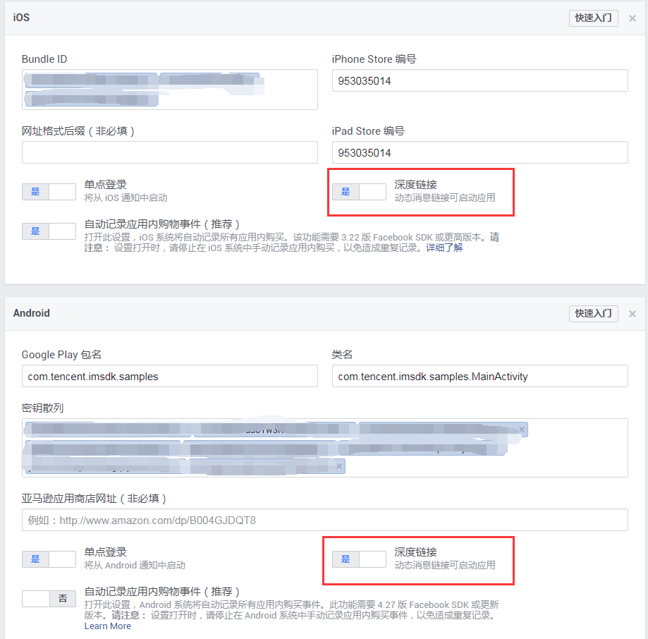
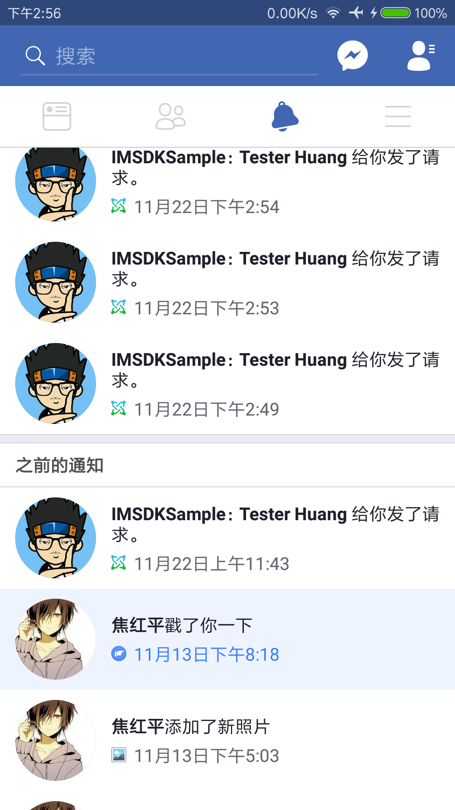
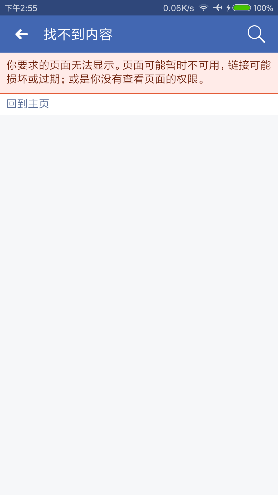
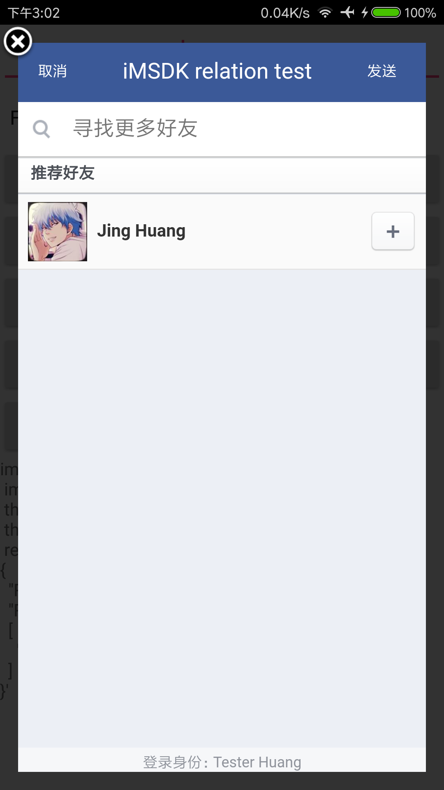

[TOC]


# Facebook SDK更新

> 新版本 4.27.0
>
> 老版本 4.15.0 (2016 年 8 月 23 日)

## 1. sdk 相关更新点

- Facebook SDK 现在会于应用启动时自动初始化。大多数情况下不再需要手动调用 FacebookSDK.sdkInitialize()
- 已停用 `FBSDKShareLinkContent` 的 `title`、`description`、`caption` 和 `image` 字段。请采取适当的措施移除对它们的使用。
- 新增对取消注册登录回调的支持
- 快捷登录调用成功时，可获得用户的个人主页这要求设备安装 Android 版 Facebook v131。
- 更改 ShareDialog.canShow，从而当用户尝试从 ShareOpenGraphContent 分享本地图片到网页对话框时，正确返回 false。
- 将 Facebook SDK 重组为多个彼此独立但相互依存的库/模块。


## 2. 影响功能点 

### 1> xml 主题删除

Facebook sdk 已内置

```xml
<!--android:theme="@android:style/Theme.Translucent.NoTitleBar"-->
<activity
    android:name="com.facebook.FacebookActivity"
    android:configChanges="keyboard|keyboardHidden|screenLayout|screenSize|orientation"
    android:label="@string/app_name" />
```

### 2> [TYPE_DIALOG_LINK](https://developers.facebook.com/docs/reference/androidsdk/current/facebook/com/facebook/share/model/sharelinkcontent.builder.html/)

> **将 Android SDK 4.21.1 升级至 4.22.0**
>
> 已停用 `FBSDKShareLinkContent` 的 `title`、`description`、`caption` 和 `image` 字段。请采取适当的措施移除对它们的使用。

- 影响功能点

> 发送消息，分享 link
> ```java
> /**弹对话框链接分享类型**/
> public static final int TYPE_DIALOG_LINK    = 3;
> ```


android 提示告警，但不影响功能！

```java
ShareLinkContent.Builder builder = new ShareLinkContent.Builder();
// Deprecated 三个方法
// 影响点
// builder.setContentTitle(info.title);
// builder.setContentDescription(info.content);
// builder.setImageUrl(convert2Uri(info.imagePath));

builder.setContentUrl(convert2UriWithParas(info.link, info.extraJson));
builder.setPeopleIds(getSendToFriendList(info.extraJson));
```

### 3> 分享接口 

更新到最新的 facebook app，分享成功以后，界面会停留在 timeline界面，按返回键才会返回到sample

老版本是会直接返回到sample

### 4> 初始化接口去除

Facebook SDK 现在会在应用程序启动时自动初始化。如果您在主进程中使用 Facebook SDK 并且不需要在 SDK 初始化完成时执行回调，现在可以删除对 FacebookSDK.sdkInitialize 的调用。如果您需要执行回调，则应在代码中手动调用回调；

```java
// 不需要这种显示调用初始化
if(!FacebookSdk.isInitialized()){
  	FacebookSdk.sdkInitialize(context);
}
```


## 3. app拉起问题

### 1> invite 邀请拉起

[App高级配置](https://developers.facebook.com/apps/423362744481374/settings/) 中配置 android 平台，填写正确的

- Google Play 包名

- 类名（包括包名）

- 打开`deeplink 深度链接`选项

  在测试应用的 Facebook 管理端中有 iOS/Android 相关的配置，其中有一个深度链接选项，这个选项也必须打开。

  > 这个配置项的检测是在 invite 发送的时候检测的，如果在 invite 发送的时候，deeplink 选项没有打开，发送完成以后再打开 deeplink 选项，点击这个 invite 消息也是无法跳转的！

  

  如果该选项没有打开，点击收到的消息时

  

  ​

  跳转会失败，如下图：

  

  ​

### 2> sendMessage 拉起

**Facebook 链接制作工具入口已经关闭**

配置步骤：

- [创建应用链接](https://developers.facebook.com/quickstarts/423362744481374/?platform=app-links-host) 中创建 fb 开头的应用链接:

  > Enter App Data to Build Your App Link
  >
  > Android Data
  >
  > URL
  >
  > imsdk://sample

- AndroidManifest.xml 中配置 scheme

  ```xml
  <activity
              android:name=".MainActivity"
              android:label="@string/title_activity_base"
              android:theme="@style/AppTheme.NoActionBar">
              <intent-filter>
                  <action android:name="android.intent.action.MAIN"/>
                  <category android:name="android.intent.category.LAUNCHER"/>
                	
                  <data android:scheme="imsdk" />
              </intent-filter>
          </activity>
  ```


  该种方式通过 Message app 处理消息，点击后会拉起 app，收到的日志信息如下：

```java
I/ActivityManager: START u0 {act=com.facebook.application.423362744481374 dat=https://fb.me/... flg=0x10000000 cmp=com.tencent.imsdk.samples/.MainActivity (has extras)} from uid 10128 on display 0
```

### 3> share拉起

- 如果 [应用链接](https://developers.facebook.com/quickstarts/423362744481374/?platform=app-links-host) 中配置了 Android Data URL，比如 imsdk://sample:6060/friend，则 sample 需要对应配置 [标准 URL SCHEME 协议](## 4. 标准 URL SCHEME 协议)

  ```xml
  <activity
              android:name=".MainActivity"
              android:label="@string/title_activity_base"
              android:theme="@style/AppTheme.NoActionBar">
              <intent-filter>
                  <action android:name="android.intent.action.MAIN"/>
                  <category android:name="android.intent.category.LAUNCHER"/>
                  
                	<!--条件1：下面两个必须配置-->
                  <category android:name="android.intent.category.DEFAULT"/>
                  <action android:name="android.intent.action.VIEW"/>
                
                	<!--条件2：此处也必须配置，下面的配置只能少不能多，但不能没有-->
                  <data android:scheme="imsdk"
                      android:host="sample"
                      android:port="6060"/>
              </intent-filter>
          </activity>
  ```

  日志如下：

  ```xml
  ActivityManager: START u0 {act=android.intent.action.VIEW dat=imsdk://sample:6060/friend?target_url=https://fb.me/1000398036777839 flg=0x10000000 cmp=com.tencent.imsdk.samples/.MainActivity (has extras)} from uid 10286 on display 0
  ```

  ​

- 如果没有配置 Android Data URL

  日志如下：
  ```xml
  ActivityManager: START u0 {dat=fbrpc://facebook/nativethirdparty?app_id=423362744481374&tap_behavior=interstitial_install_only&extra_applink_key=al_applink_data&referer_data_key=extras&al_applink_data={"target_url":"https:\/\/fb.me\/1000398036777839","extras":{"fb_app_id":423362744481374},"referer_app_link":{"url":"fb:\/\/\/","app_name":"Facebook","package":"com.facebook.katana"}}&appsite_data={"android":[{"is_app_link":true,"app_name":"IMSDKSample","market_uri":"market:\/\/details?id=com.tencent.imsdk.samples&referrer=utm_source\u00253Dapps.facebook.com\u002526utm_campaign\u00253Dfb4a\u002526utm_content\u00253D\u0025257B\u00252522app\u00252522\u0025253A423362744481374\u0025252C\u00252522t\u00252522\u0025253A1509625266\u0025257D","package":"com.tencent.imsdk.samples"}]}&has_app_link=1 cmp=com.facebook.katana/com.facebook.intent.thirdparty.ThirdPartyUriActivity (has extras)} from uid 10286 on display 0
  ```


## 4. (非)同玩好友拉取

需要满足几个条件：

- 配置 web
- 获取 user_friend权限
- 应用设置里面需要指定为 **游戏类别**


## 5. 其它问题

### 1> invite 接口界面

Facebook invite 接口会拉起如下界面，也就是邀请可以邀请的好友，这个好友必须是没有安装这个 App 或者登录过的账号，如下图。



但是如果在测试的时候已经使用过这个账号，那上面的界面中就没有这个好友，如果还是想通过这个账号来测试，则需要在当前账号的 Facebook 设置中清除相应的登录信息。

路径：

> Facebook -> 设置 -> 应用


在`应用设置`中可以查看所有通过 Facebook 登录授权的应用，找到相应的应用并移除掉，重新登录测试，再走 invite 邀请，拉起的界面中就会出现想要的账号了。


## X. 标准 URL SCHEME 协议

格式如下：

```xml
xl://goods:8888/goodsDetail?goodsId=10011002
```

通过上面的路径 Scheme、Host、port、path、query全部包含，基本上平时使用路径就是这样子的。

- xl 代表该Scheme 协议名称
- goods 代表Scheme作用于哪个地址域
- goodsDetail 代表Scheme指定的页面
- goodsId 代表传递的参数
- 8888 代表该路径的端口号

### 1> 配置

```xml
 <activity
            android:name=".GoodsDetailActivity"
            android:theme="@style/AppTheme">
       
            <intent-filter>
                <!--协议部分-->
                <data android:scheme="xl" 
                      android:host="goods" 
                      android:path="/goodsDetail" 
                      android:port="8888"/>
              
                <!--下面两行必须得设置-->
                <category android:name="android.intent.category.DEFAULT"/>
                <action android:name="android.intent.action.VIEW"/>
              
              	<!-- 网页唤起时才需要设置 -->
                <category android:name="android.intent.category.BROWSABLE"/>
            </intent-filter>
        </activity>
```

### 2> 被唤醒的App内获取参数

```java
Uri uri = getIntent().getData();
if (uri != null) {
    // 完整的url信息
    String url = uri.toString();

    // scheme部分
    String scheme = uri.getScheme();

    // host部分
    String host = uri.getHost();

    //port部分
    int port = uri.getPort();

    // 访问路劲
    String path = uri.getPath();

    List<String> pathSegments = uri.getPathSegments();
    // Query部分
    String query = uri.getQuery();

    //获取指定参数值
    String goodsId = uri.getQueryParameter("goodsId");

}
```

### 3> 调用方式

网页上

```js
<a href="xl://goods:8888/goodsDetail?goodsId=10011002">打开商品详情</a>
```

android 调用

```java
Intent intent = new Intent(Intent.ACTION_VIEW,Uri.parse(
  "xl://goods:8888/goodsDetail?goodsId=10011002"));
startActivity(intent);
```

### 4> 判断 Scheme 是否有效

上一步的 startActivity 如果没有指定的 Activity 被匹配处理的话， 是会Crash的，考虑到这一点，需要事先作判断；

```java
PackageManager packageManager = getPackageManager();
Intent intent = new Intent(Intent.ACTION_VIEW, Uri.parse(
  "xl://goods:8888/goodsDetail?goodsId=10011002"));
List<ResolveInfo> activities = packageManager.queryIntentActivities(intent, 0);
boolean isValid = !activities.isEmpty();
if (isValid) {
    startActivity(intent);
}
```

### 5> H5 拉起

这种方式同上面 3> 调用方式的网页版本，即自己写一个H5网页

```html
<!DOCTYPE html>
<html lang="en">
<head>
    <meta charset="UTF-8">
    <title>Just For iTop Client Group</title>
</head>
<body onload="jumpToURLScheme()">

<script>
function jumpToURLScheme(){
    window.location = "xl://goods:8888/goodsDetail?goodsId=10011002";
}
</script>

</body>
</html>
```

假设这个 H5 网页的网络访问地址为

*https://open.qq.com/itop_client_test/urlschemetest.html*

则可以使用上面这个url来拉起相应的app。

