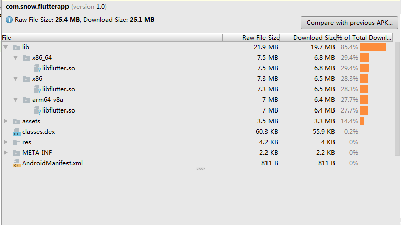

# Flutter

[官方传送门](https://flutter.io/)

## 1. Flutter 是什么

> Flutter is Google’s mobile UI framework for crafting high-quality native interfaces on iOS and Android in record time. Flutter works with existing code, is used by developers and organizations around the world, and is free and open source.

Flutter 是 Google 用以帮助开发者在 iOS 和 Android 两个平台开发高质量原生应用的全新移动 UI 框架，使用`Dart`语言构建。

Flutter 的目标是解决移动开发中的两个重要问题：

- 其一是实现原生应用的性能和与平台的集成。
- 其二是提供一个多平台，可移植的 UI 工具包来支持高效的应用开发。

Flutter 开发出来的应用在不同的平台用起来跟原生应用具有一样的体验。不同平台的滚动操作、字体、图标 等特殊的特性 应该和该平台上的其他应用保持一致，让用户感觉就像操作原生应用一样。比如，返回图标 Android 和 iOS 是不一样的；滚动内容滚动到底的反馈也是不一样的。


**优点：**

1. 免费开源
2. 高效率
   - 一套代码可以开发出 Android 和 iOS 应用
   - 同样的功能，使用`Dart语言`只需要很少的代码，可以开发出原生应用同样的功能
3. Hot reload **真正的热加载**
   - 在应用运行的时候就可以修改代码并重新加载修改后的功能
   - 直接修改崩溃的 bug，然后继续从崩溃的地方执行调试
4. 创建优雅的、可定制的用户界面
   - lutter 内置了对纸墨设计（Material Design）的支持，提供了丰富的 UI 控件库可以用来创建纸墨设计风格的 UI
   - 提供了可定制的 UI 框架，不再受制于手机平台控件的支持。

**时间线：**

17年9月份，alpha 版本。

18年2月份，第一个 beta 版本。

**应用：**

Flutter 已经被应用在拥有数百万安装量的线上应用中：

- [Hamilton - Google Play](https://play.google.com/store/apps/details?id=com.hamilton.app)
- [Hamilton - App Store](https://itunes.apple.com/cn/app/hamilton-the-official-app/id1255231054?mt=8)

**生态：**

- 超过 1000 个 Flutter 库（例如：SQLite, Firebase, Facebook Connect, shared preferences, GraphQL 等等）。
- Google 开发组人员 1700+
- 社区网站  Flutter Institute、Start Flutter 和 Flutter Rocks
- Flutter Weekly 周报 https://flutterweekly.net

**正在开发的功能：**

- 集成 Flutter 到现有应用、内嵌 WebView、更好的路由和导航 API、更多的 Firebase 支持、内嵌地图、更小的核心引擎，还有更多其它功能。
- 每四周发布一个新的 beta 版本


## 2. Flutter 技术

### 2.1 跨平台

Flutter能够在iOS和Android上运行起来，依靠的是一个叫 Flutter Engine 的虚拟机，Flutter Engine是Flutter应用程序的运行环境，开发人员可以通过Flutter框架和API在内部进行交互。

Flutter Engine使用C/C++编写，具有低延迟输入和高帧速率的特点。

**Android**

Android应用程序是运行在Dalvik虚拟机里面的，并且每一个应用程序对应有一个单独的Dalvik虚拟机实例，但是Flutter应用程序不使用Dalvik虚拟机。



Flutter编译的Android应用程序自带独立的虚拟机。

**iOS**

Flutter编译的iOS应用程序采取的方案是，使用iOS运行时(Runtime)实现跨平台，iOS运行时(Runtime)是一个用汇编写的一段程序，可以执行C/C++编译的二进制。

iOS原生开发的Objective-C语言也是通过iOS运行时(Runtime)执行C/C++的二进制文件，所以Flutter编译的iOS应用能和原生应用不相上下。


### 2.2 框架分层

Flutter框架被划分为一系列层级，并且每一层都是基于前一层来构建。


这种分层设计的目的是帮助开发者写更少的代码来实现功能。例如，Material层通过组合Widget层的控件来构建，而Widget层本身则依赖Rendering层来构建。

上述分层为我们开发App提供了很多选择，首先可以使用Flutter提供的现有Widget来组合，或者创建自定义的Widget。自己创建控件也很简单，Flutter是开源的，如果不仅仅局限于了解上层Widget的概念，有兴趣的话可以去探索底层的实现原理。

*Flutter 提供的 widget 都是基于 skia 来实现和精心定制的，与具体平台无关，所以能保持很高的跨 OS 跟 OS Version 兼容性*

**处理用户交互**

如果Widget的特性基于用户交互或其他因素进行改变，则这个Widget是有状态的。

例如，如果一个Widget有一个计数器，每当用户点击一次按钮，计数器的值就增加，计数器的值就是这个Widget的状态。当计数器值改变时，Widget需要重新更新UI。


这种处理模式可以参考 Google 最近刚刚推出的 App 搭建框架 [**Android Architecture Components**](https://developer.android.com/topic/libraries/architecture/index.html)

### 2.3 与传统开发模式对比 

- **OEM SDK开发模式**

  通过 SDK 与系统通信，不同平台有不同的 SDK 和组件，开发语言也可能不同，如 Android 用 Java，iOS 用Objective-C。


​	不得不为每个平台开发单独的App，因为这些系统组件都是不一样的。

- **Hybrid 方式**

  用JavaScript代码开发H5页面，然后渲染到平台的WebView上。但是 JS 与 Native 代码之间的通信需要使用JSBridge 进行上下文切换，因为平台服务通常不会经常被调用，所以这并不会导致太大的性能问题。


- **ReactNative 方式**

2015年， React Native 将响应式视图的许多优势带给了移动应用程序。


​	RN 方式直接使用 JS 访问原生UI组件，因此必须经过”桥接器”，由于依然存在一个从JS代码到原生代码的转化过程，在界面UI被频繁操作的情况下，可能会导致性能问题。

​	Android 和 iOS 的 RN 代码并不完全相同。

	> 理解React Native性能的其中一个关键，JS代码和原生代码本身都是很快的，瓶颈经常发生在当我们视图从一边转向另一边时。未来构建高质量的应用程序时，我们必须将使用桥接的次数控制到最小。

- **Flutter 方式**

  和 React Native 一样，Flutter 也提供响应式的视图，Flutter采用不同的方法避免由JavaScript桥接器引起的性能问题，即用名为Dart的程序语言来编译。


​	Dart 是用预编译的方式编译多个平台的原生代码，这允许Flutter直接与平台通信，而不需要通过执行上下文切换的JavaScript桥接器。编译为原生代码也可以加快应用程序的启动时间。

​	Android 和 iOS可以利用同一套代码。

> Flutter是唯一提供响应式视图而不需要 JavaScript 桥接器的移动 SDK

### 2.4. 竞品

1. Weex，阿里出品，[传送门](http://weex.apache.org/cn/)
2. React Native，Facebook 出品，[传送门](http://facebook.github.io/react-native/)

## 3. Flutter 开发环境搭建

### 3.1 Get the Flutter SDK

```bash
git clone -b beta https://github.com/flutter/flutter.git
```

Mac 或 Windows 上设置环境变量。

### 3.2 Run flutter doctor

第一次运行会下载相应的依赖。

```bash
flutter doctor
```

### 3.3 [Configure IDE](https://flutter.io/get-started/test-drive/#androidsstudio)

安装包的编译依赖于 `iOS` 及 `Android` sdk 的安装。

Android 支持 IntelliJ IDEA, Android Studio, and VS Code

iOS 支持 XCode


