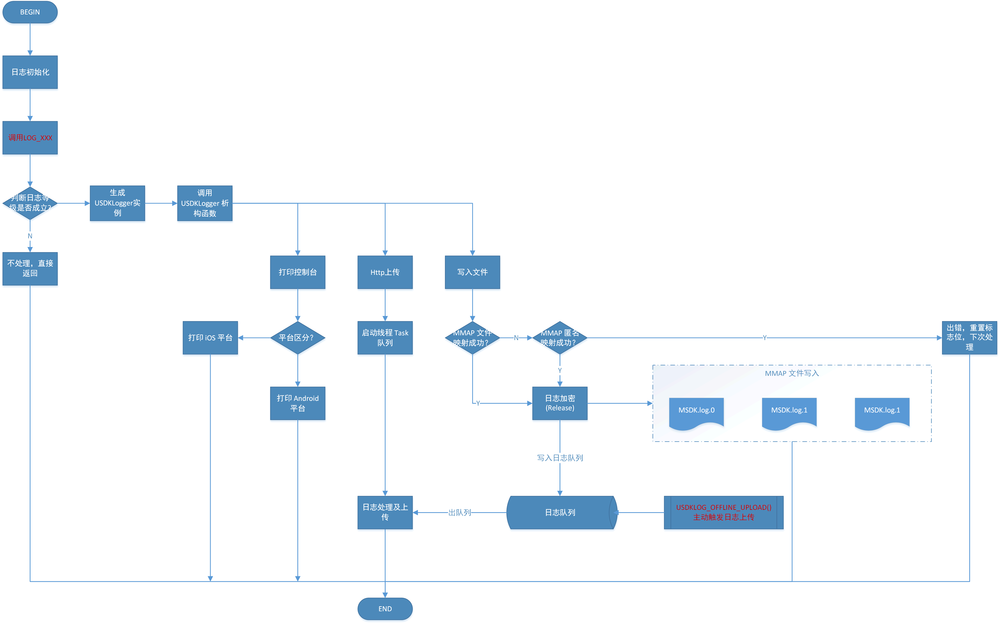

# MSDK Log


> mlog_mutex.h
>
> 1. 日志锁


> preprocessor.h
>
> 1. 针对 Android、iOS，WP等平台的编译适配
> 2. 结合 mlog.h 实现日志类的 `MLogger` 的自动析构
>


> mlog.h
>
>
> 1. 日志宏定义入口
> 2. 日志参数判断
> 3. 日志字符格式化
> 4. 日志打印工具类`MLogger`定义
> 5. `MLogger 自动析构实现`，在析构函数中触发日志打印及日志写入


> mem_map.cpp
>
> 1. mmap 实现类，比较独立


> local_log_upload.cpp
>
> 1. 日志离线上传类，比较独立
> 2. 压缩日志
> 3. 上传日志回调定义


> mlog_base.cpp
>
> 1. 日志类型定义
> 2. 日志打印级别定义
> 3. 日志结构体定义 `MLoggerInfo`
> 4. 日志变量字符串转换工具类
> 5. 日志模块底层实现触发回调定义，所有的入口在此处触发，即 `Global类`
> 6. 操作`mlog_wrapper`处理日志


> mlog_manager.h
>
> 1. 日志上传队列处理
> 2. 日志处理线程管理
> 3. 日志压缩
> 4. 日志加密
> 5. 日志上传触发
> 6. 日志上传路径，URL管理


> mlog_wrapper.cpp
>
> 1. 日志模块初始化入口
> 2. 打印级别设置
> 3. 打印模式设置
> 4. 操作mmap写日志实现


# USDK Log 实现

> 实现功能：
>
> 1. mmap 文件映射
> 2. 控制台日志打印，方便调试
> 3. 宏定义入口
> 4. 日志加密，上传接口预留


> 待处理功能：
>
> 1. 加密，离线上传功能
> 2. 队列处理
> 3. 日志特殊字符转换，日志大小格式化，日志文件管理，路径等工具方法
> 4. 规范调整


# USDK Log 说明

## 1. 使用方法

### 初始化

引入`USDKLog.h`头文件后，调用下面接口执行日志初始化，然后就可以使用 api 打印日志。

```java
USDKLOG_INIT();					// 初始化
```

此时会通过云端配置拉取`日志等级` 和 `日志模式`，并进行设置。

如果想更改`日志等级`和`日志模式`，也可以通过下面更改。

```java
int mode = 3;
SET_USDKLOG_MODE(mode);			// 设置日志模式
ULogLevel level = kLevelInfo;
SET_USDKLOG_LEVEL(level);		// 设置日志等级
```

### 日志文件名及大小设置

使用下面接口设置文件名及单个日志文件大小。

```java
string default_path = USDKFileUtils::getInstance()->filePathForUSDK(false);
unsigned long fileSize = 1 * 1024 * 1024;
string name = default_path + "/MSDKTest.log";
SET_USDKLOG_FILE(name, fileSize);	// 设置文件名及单个日志文件大小
```

如果不调用该接口，默认使用的日志文件名为 `MSDKLog.log`，默认日志大小为2M。

`SET_USDKLOG_FILE 接口中设置的文件名，必须是绝对路径`

> 若日志文件为`MSDKLog.log`，则 sdcard 中实际的初始文件为`MSDKLog.log.0`，当该文件写满后，会将该文件重命名为 `MSDKLog.log.1`，当前日志继续写入到文件`MSDKLog.log.0`中，也就是序号`0 ~ 9`，代表日志从新到旧；
>
> 当日志个数超过10以后，会从旧到新删除日志。

### 离线上传接口

调用下面接口启用日志离线上传。

```java
USDKLOG_OFFLINE_UPLOAD()
```


## 2. 接口 API

### 日志写文件

引入`USDKLog.h`头文件后，使用下面 api 进行日志写入。

```java
LOG_VERBOSE(...)  	// 所有日志
LOG_DEBUG(...)    	// debug日志
LOG_INFO(...) 		// info日志
LOG_WARN(...) 		// 告警日志
LOG_ERROR(...) 		// 错误日志
```

默认情况下（Release 模式），上面接口不会打印日志到控制台。若需要打印日志到控制台或者在调试（Debug）模式下，可定义下面这个宏开启日志打印。

```java
#define USDK_DEBUG
```

### 日志打印控制台

引入`USDKLog.h`头文件后，使用下面 api 进行日志打印控制台。

```java
ulogverbose(...)	
ulogdebug(...)  
uloginfo(...)   
ulogwarn(...)   
ulogerror(...)  
```

上面日志接口的使用场景如下：

- 不需写文件，仅仅是打印控制台的情况。
- `Log` 模块内部只能使用上面 api 进行打印，防止出现日志模块内部再进行日志写入，进入死循环。

### 日志分级

日志模式下分级枚举类型如下：

```java
kLevelVerbose
kLevelDebug,  // 调试使用日志
kLevelInfo,   // 输出有用信息的日志
kLevelWarn,   // 告警日志
kLevelError,  // 错误日志
```

该类型已经封装在接口 API 中。

### 日志模式

日志模块支持下面三种模式，为枚举类型。

```java
kConsole = 0x1,       // 打印控制台
kFile = 0x2,          // 打印文件
kHttp = 0x4,          // 文件上报
```

这三种模式可以共存，使用3位二进制进行`&`操作，判断规则如下：

```java
if ((getLogMode() & kConsole) == kConsole) {
    // 进入 kConsole 模式
}
```

如果只想使用`kConsole`模式，则可以调用接口 `SET_USDKLOG_MODE(1)`。

如果想使用 `kConsole` 和 `kFile` 两种模式，则可以调用接口 `SET_USDKLOG_MODE(3)`。

## 3. 流程图



### 

# ITOP WebView

## 1. MSDK

```java
public static void WGOpenUrl(String openUrl);
public static void WGOpenUrlWithScreen(String openUrl,int screendir);
public static String WGGetEncodeUrl(String url);
// JS 回调测试

```


