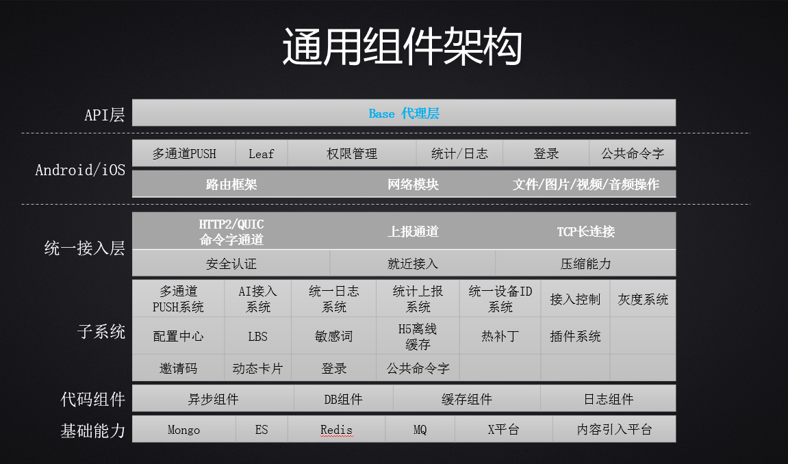
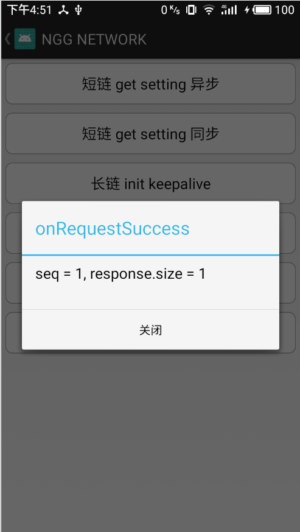

[TOC]

| 时间      | 版本 | 备注 |
| --------- | ---- | ---- |
| 2018-7-16 | V1.0 | 初稿 |


# 通用统一平台框架插件开发规范

# 1. 平台框架

在现有平台框架添加`base代理层`，它直接与项目侧对接，目的主要是屏蔽通用能力插件实现，方便后续插件切换实现，比如网络短链现在是quic，后续有可能是其它实现。

对于项目侧，只需要关心`base层`的 api 调用接口，并且会尽可能简单。



**base代理层**职责：

> 1. 封装统一接入层对外api，项目侧只对接base层；
> 2. 统一所有模块对外接口，添加统一前缀`NGG`，风格统一，接口友好，无学习成本；
> 3. 定义`base层`与`impl插件层`的协议，方便base包通过反射找到相应的实现；
> 4. 定义统一接入层所有需要使用的公共类、工具、方法，数据结构，回调等，所有插件层可共用。


# 2. 实现原理

由`base代理层`定义插件包类名协议，类似于 

```java
public static final String DEFAULT_PACKAGE_NAME_NETWORK_FORMAT = "com.tencent.cgcore.network.%sNetworkImpl";
```

项目侧调用 **NGGNetwork** api时，会执行反射，找到相应的实现即可完成调用。

```java
Constructor constructor = null;
try {
    Class cls = Class.forName(name);
    constructor = cls.getDeclaredConstructor(Context.class);
    if (constructor != null) {
        constructor.setAccessible(true);
        obj = constructor.newInstance(mCtx);
    }
} catch (Exception e) {
    NLog.e("can't get instance of '" + name + "' : " + e.getMessage());
}
```

具体流程可以参考 **NGGNetwork**实现；


# 2. 开发流程

完整的插件模块开发流程，在完成

- 方案评估选型
- 方案测试验证

两步后，可以进行插件完成开发，这里有几个原则：

> 1. 模块对外API命名需统一，采用 **NGG + 模块名** 形式，如 `NGGNetwork`、`NGGInvite`等。
> 2. 对外API暴露的类文件应尽可能少，一般情况下，一个类即可。
> 3. 插件层实现API命名需统一，采用 **模块名 + Impl** 形式，如果后续考虑到项目侧自主选择插件实现方式，此处可改为 **渠道 + 模块名 + Impl** 形式，项目测通过传入不同的渠道，选择不同的实现。

具体开发流程如下

## 2.1 定义base层

base 层会以下面这种形式提供给项目侧。

```xml
implementation 'com.tencent.ngg.mobile:base:1.0.0@aar
```

`项目侧在只引入base包的情况下，也可以运行，只是具体的接口没有实现，这也可作为一个接口封装标准。`

### 2.1.1 定义base层模块API

> 包名地址：*`com.tencent.ngg.api.模块.NGG模块.java`*

此处是定义项目侧可以使用的API数量及使用方法，以具体模块的功能为准，合理的暴露api出来。

规则如下：

- 此处都是`static`方法
- 驼峰命名接口
- 不影响功能的情况下，接口尽可能少
- 同一个模块（比如网络）的不同子模块都需要暴露的（比如长链，短链），java文件可以分开

具体可以参考 `com.tencent.ngg.api.network.NGGNetwork.java`。

### 2.1.2 定义插件实现包名

> 包名地址：*`com.tencent.ngg.IR.java`*

定义base层与插件层交互的协议包名，如下

```java
public class IR {

    /**
     * 定义各模块的 package name
     */
    public static class pkg {

        public static final String DEFAULT_PACKAGE_NAME_NETWORK_FORMAT = "com.tencent.cgcore.network.%sNetworkImpl";
        public static final String DEFAULT_PACKAGE_NAME_INVITE_FORMAT = "com.tencent.ngg.invite.%sInviteImpl";
    }
}
```

base层会根据此处的协议找到具体插件Impl实现；

### 2.1.3 定义插件base基类

> 包名地址：`*com.tencent.ngg.base.模块.NGG模块Base.java*`

项目侧在只引入的 base 包的情况下，也可运行测试，所以base层需要封装一个基类，它是插件层功能接口的抽象，规则如下：

- 插件层实现需要继承相应的 base 基类
- 在相应的实现接口中，填充插件层接口实现逻辑

具体可以参考 `com.tencent.ngg.base.network.NGGNetworkBase.java`。

### 2.1.4 封装接口实现

完成上面三步可，可以实现base层与插件层对接逻辑，如下：

```java
private static NGGNetworkBase mNetwokImpl = null;
public static void init(Context context, NetWorkInitParam param, Class claz) {
    if (mNetwokImpl == null) {
        String packageName = String.format(IR.pkg.DEFAULT_PACKAGE_NAME_NETWORK_FORMAT, "");
        mNetwokImpl = NGGModules.getInstance(context).getChannelInstance(NGGNetworkBase.class, packageName);
    }
    mNetwokImpl.init(context, param, claz);
}
```

`NGGModules`工具类封装了寻找插件实现类的接口，所有插件层都可以共用。

在获取到插件后，base层可以使用`NGGNetworkBase`来完成接口封装。

## 2.2 实现Impl插件层

插件层需要实现 base 层定义的基类实现，所有的插件层均依赖于 base 模块；

```java
public class NetworkImpl extends NGGNetworkBase {

    public NetworkImpl(Context context) {
        NLog.d("NetworkImpl new success!");
    }
}
```

其它规则如下：

- 插件层的一些公共逻辑与方法，可以抽取到base层，方便管理。

- 项目侧在接入api的时候，会使用到一些数据结构，之前是放在插件层的，新增base层后，这部分需要抽取到base层。


# 3. 验证测试流程

针对功能开发验证及demo管理，有以下几个规则：

- 统一管理一个sample
- 开发验证问题时，以源码形式引入依赖
- 交付测试时，以maven形式引入依赖

## 3.1 sample管理

### 3.1.1 代码管理

针对之前一个模块一个工程的形式，改为统一维护一个sample，功能模块以 module 形式引入。

```xml
com
└── tencent
	   └── ngg
			└── samples
				 └── app
					├── jce 定义命令字
					└── ***TestActivity 测试Activity
				 └── base 代理层实现
				 └── mavencheck maven引用
				 └── plugins 插件实现
						└── network 网络插件
						└── invite 邀请码插件
```

- app - 测试sample，命名规则是 **模块+TestActivity.java**
- base - 代理层module
- mavencheck - maven引用gradle，用于上线前开发测试验证
- plugins - 插件实现module

### 3.1.2 回调管理

通过日志来查看API返回结果，不够友好，直观，sample中所有涉及返回结果的地方，以`Toast`形式展示。



`com.tencent.ngg.samples.BaseActivity`已经封装好所有接口，可以直接使用。

所有测试Activity，都需要继承 BaseActivity，完成风格统一。


## 3.2 开发验证

开发在调试验证过程中，应该以源码形式（只针对功能模块debug版本）引入模块进行验证，发布成 release 版本后，可以 maven 形式引入。

```xml
    implementation project(':plugins:network')
    implementation project(':plugins:networkcommon')
    implementation project(':plugins:networkpush')
```

源码引入方便调试，并且可见即可得，提高开发效率。

如下

```xml
// 开发模式A与验证模式B共用一套 Sample 代码，下面两种模式互斥；
include ':app'

// 开发模式A - 以源码工程形式引用，方便调试；
include ':base'
include ':plugins:androidos'
include ':plugins:invitationcode'
include ':plugins:network'
include ':plugins:networkcommon'
include ':plugins:networkpush'

// 验证模式B - 以 maven 形式引用
//include ':mavencheck'
```


## 3.3 测试交付验证流程

开发自测完成后，应以 maven 形式引入验证，确保开发验证的环境与测试、项目侧保持一致。

```xml
    compileOnly 'com.tencent.ngg.mobile:wup:1.0.0'
    implementation 'com.tencent.ngg.mobile:network-common:1.0.6-SNAPSHOT@aar'
```

此处使用 mavencheck module来验证。

```xml
// 开发模式A与验证模式B共用一套 Sample 代码，下面两种模式互斥；
include ':app'

// 开发模式A - 以源码工程形式引用，方便调试；
// include ':base'
// include ':plugins:androidos'
// include ':plugins:invitationcode'
// include ':plugins:network'
// include ':plugins:networkcommon'
// include ':plugins:networkpush'

// 验证模式B - 以 maven 形式引用
include ':mavencheck'
```

如果自测通过，测试模块验证问题应该很快。


## 3.4 gradle管理

**nggsdk\build.gradle**

工程根目录gradle文件，此处可以定义一些公共版本号，三方插件版本等。

```xml
ext {

    androidBuildToolsVersion = '27.0.3'
    androidMinSdkVersion = 14
    androidTargetSdkVersion = 27
    androidCompileSdkVersion = 27
    androidSupportVersion = "27.1.1"

    androidSupportDependencies = [
            v4 : "com.android.support:support-v4:${androidSupportVersion}",
            appCompat : "com.android.support:appcompat-v7:${androidSupportVersion}",
            design : "com.android.support:design:${androidSupportVersion}",
            androidAnnotations: "com.android.support:support-annotations:${androidSupportVersion}"
    ]
}

// jar包中打入git版本号
def svnVersion(String url){
    String localVerNumber = "git rev-list HEAD --count ${url}".execute().text;
    println(url + " localVersionNumber = " + localVerNumber.trim());
    return (localVerNumber != null && localVerNumber.length() > 0) ? Integer.parseInt(localVerNumber.trim()) : (Integer)System.currentTimeSeconds();
}
```

base层及插件层可以抽取公共代码如下

```xml
// 定义版本号
def mVersionName = "1.0.0"

android {
    compileSdkVersion rootProject.ext.androidCompileSdkVersion

    defaultConfig {
        minSdkVersion rootProject.ext.androidMinSdkVersion
        targetSdkVersion rootProject.ext.androidTargetSdkVersion
        versionCode rootProject.svnVersion("proxy")
        versionName mVersionName

        testInstrumentationRunner "android.support.test.runner.AndroidJUnitRunner"

    }
}
```


# 4. 开发分支与版本管理

## 4.1 开发分支

`master`分支需要锁定，严禁未轻测试验证的功能代码直接在`master`分支提交。

功能代码开发应另起分支进行。

由于测试同学会修改工程的`gradle`文件，所以针对单个功能，需要在master分支的基本上出一个测试分支。

比如开发 网络框架功能：

- 开发分支如 `feature-network-子模块`
- 测试分支可以统一为一个，可共用，如 `feature-nggsdk-test`


## 4.2 正式版本与快照版本

目前正式版本与快照版本的定义比较随性，此处可以去除快照版本，通过大版本号与小版本号来区分。

版本号管理：**主版本号.子版本号.阶段版本号**

```xml
// 定义版本号
def mVersionName = "1.0.0"
```

- 正式版使用主版本号 + 子版本号；
- 主版本号一般情况下不允许修改，子版本号针对功能进行修改；
- 阶段版本号对应之前的快照版本，为灰度版本，灰度完成后应合入主干分支；

# 5. 开发测试协议规范

以下为开发与测试商定的测试规范，开发与测试同学请严格遵守，实施过程中有任何可以改进的地方，再修改；

## 5.1 开发测

开发侧在完成某个插件后，需要提供一份文档，其中包含：

1. 对外暴露API功能说明；
2. 对应SDK的初始化入口 及使用说明；
3. 请在工程根目录下面创建README.md，git平台会自动展示里面的内容。当增加一个新功能或者模块时，更新工程根目录下面的README.md文档，方面统一管理，请至少包含如下两个方面： 
   - 在QQ docs中提供API说明文档的链接，Google docs 也可；
   - 开发过程中评审用到的相关文档，模块整体架构图等都可以上传上来，方面测试和开发同学查看，了解相关功能点，同时也是一个积累的过程。
4. 当有新组件并且开发同学已经投入开发时，请告之一下测试这边的接口同学richarddu。会安排相关测试同学跟进，尽量保证开发和测试并行。

## 5.2 测试测

测试同学在收到开发同学的插件功能模块后，需要开展以下工作：

1. 会针对被测模块或方法梳理出清晰的逻辑图，便于分层用例的实现，更能细化出具体的逻辑；
2. 具体分层用例的实现；
3. 通过Jenkins保证用例的持续运行监控；
4. 相关模块分层测试用例进行Review，开发同学也可以一起参与 ；
5. 相关Bug会统一提到hakimhuang这里，请及时处理哦 

核动力bug链接地址请[点击][http://tapd.oa.com/nuclear/bugtrace/bugreports/my_view]，格式如下

> 【组件】【模块】【分层测试】问题描述

例如：

> 【组件】【网络】【分层测试】NetWorkServiceManager.getInstance().sendRequest发送List Request返回数据异常 


<u>*NGGNetwork网络模块已重构完成，具体可以参考代码。*</u>

