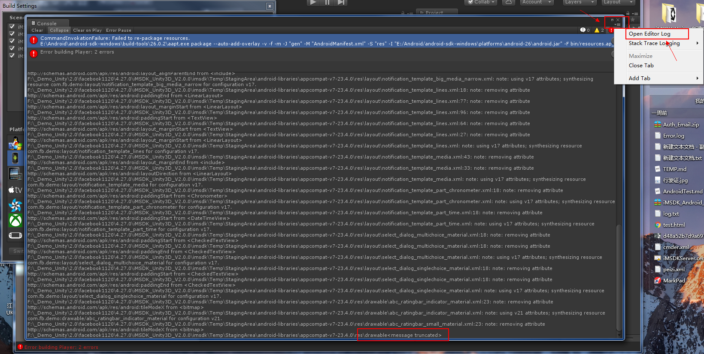
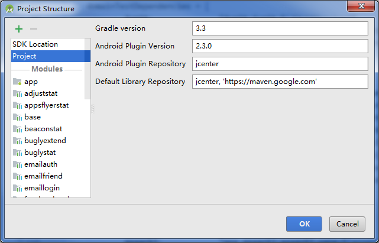
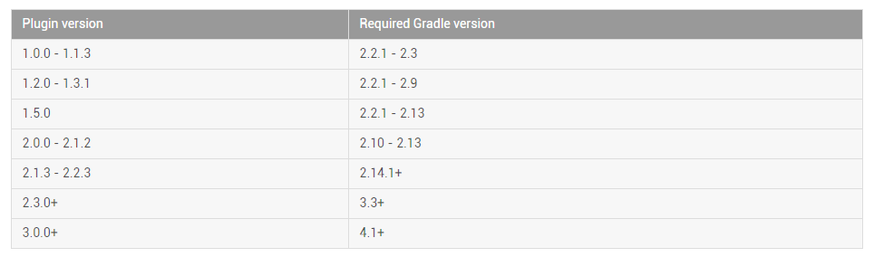

[TOC]

# 一、 Unity

## 1. 编译相关

- jdk 版本

- Android sdk 版本，默认会取 `\android-sdk-windows\build-tools` 下面最高版本编译

- unity4.X 和 Android26 不兼容同，编译 APK 会出现黑屏，[传送门][unity]

- unity 在编译的时候报错，如果日志太多是会被截断的，此时会有下面的提示，关键字`message truncated`

  ```bash
  F:\_Demo_Unity\2.0\facebook1120\4.27.0\iMSDK_Unity3D_V2.0.0\imsdk\Temp\StagingArea\android-libraries\appcompat-v7-23.4.0\res\drawable<message truncated>
  ```

  此时可以点击右上角的图标，然后点击`Open Editor Log` 获取到完整的日志信息。

  

  ​

## 2. click 事件

配置选项 `unityplayer.ForwardNativeEventsToDalvik` 为 true，即可处理点击事件

```xml
<activity 
          android:name="com.unity3d.player.UnityPlayerNativeActivity"
          android:label="@string/app_name">  
  <intent-filter>
    <action android:name="android.intent.action.MAIN"/>
    <category android:name="android.intent.category.LAUNCHER"/>
    <category android:name="android.intent.category.LEANBACK_LAUNCHER"/>
  </intent-filter>
  
  <meta-data android:name="unityplayer.UnityActivity" android:value="true"/>
  <!--此处配置为true-->
  <meta-data android:name="unityplayer.ForwardNativeEventsToDalvik" android:value="false"/>
</activity>
```

# 三、AS

## 1. Gradle

Android Studio 通过 [Gradle][build] 来构建应用程序。

通过 AS 查看工程 Gradle 版本，查看路径 `File->Project Structure->Project`




### 1> Gradle Plugin 版本

[官方传送门][gradle-plugin]

此为 Gradle 插件工具版本。

当您更新Android Studio时，系统可能会提示您自动将 Gradle 的 Android 插件更新为最新版本， 您可以选择接受更新或根据项目的构建要求手动指定版本。

它在工程目录的顶级 build.gradle 文件中

```xml
buildscript {
    repositories {
        jcenter()
    }
    dependencies {
        classpath 'com.android.tools.build:gradle:2.3.0'
        classpath 'com.neenbedankt.gradle.plugins:android-apt:1.8'

        // NOTE: Do not place your application dependencies here; they belong
        // in the individual module build.gradle files
    }
}
```


### 2> Gradle 版本

[官方传送门][gradle]

此为使用的 Gradle 版本。

更新Android Studio时，您可能会收到提示，同时将Gradle更新为最新版本。 您可以选择接受更新或根据项目的构建要求手动指定版本。

它在工程根目录下的 `\gradle\wrapper\gradle-wrapper.properties` 文件中。

```xml
#Mon Mar 27 11:40:24 CST 2017
distributionBase=GRADLE_USER_HOME
distributionPath=wrapper/dists
zipStoreBase=GRADLE_USER_HOME
zipStorePath=wrapper/dists
distributionUrl=https\://services.gradle.org/distributions/gradle-3.3-all.zip

```

[][]

它与 Gradle Plugin 的对应关系如下：



## 2. 快捷键

|                   快捷键                    |               功能                |
| :--------------------------------------: | :-----------------------------: |
|             Ctrl + Shift + A             | 快速找到命令入口，通过该命令弹窗中输入相应的提示语点击查询即可 |
|                 Ctrl + J                 |  弹出代码快捷键模板，如 TODO/FIXME 或者自定义   |
|                 Alt + F1                 |         查看代码所在的位置，非常实用          |
|              Ctrl + Alt + T              |          选中代码， 快速写包围方法          |
|         Ctrl + Shift + Backspace         |            返回上一个编辑位置            |
|                   F11                    |             添加、移除标签             |
|                Ctrl + F11                |          添加、移除书签(带标记)           |
|               Shift + F11                |       显示所有的书签列表，并且是可以搜索的        |
|        File \|Settings \| Keymap         |            设置、修改快捷键             |
| File \| Settings  Editor \| Code Style \| Java |             设置命名前缀              |
|      Alt + Enter \|  Ctrl + Alt + O      |          快速导包， 清除无用导包           |
| File \| Settings \| Editor \| General \| Auto Import |        自动完成 快速导包， 清除无用导包        |
| File \| Settings Editor \| Color & Fonts \| Android Logcat |          设置 LogCat 颜色           |
| File \| Settings \|  Editor \| Code Style \| Live Templates |        设置活动模板 常用代码的一个缩写         |
|  选中代码 \| Refactor \| Extract \| Method   |              快速写方法              |
|  选中代码 \| Refactor \| Extract \|  Style   |            快速写style             |


# 四、Git

## 1. git stash

[详细教程][git-stash]


## 2. 一个项目管理多个git分支

如果有这样一个场景，一个项目里有多个module，是分别提交到git上的。每个module是一个独立的项目，项目间可以互相引用。

```xml
include ':app'

include ':base'
project(':base').projectDir = new File(settingsDir, '../iMSDK-Android-Base/base')
```

但是在 AS 下面，发现只有第一个项目可以顺利提交到git。其他项目的git地址都默认到第一个项目上了。

项目目录.idea下有个 vcs.xml 文件。这里记录了git的项目名称，但是只有第一个可以提交的项目，手动修改，增加了其他项目后名称后，可以顺利从git上push和pull。

```xml
<?xml version="1.0" encoding="UTF-8"?>
<project version="4">
  <component name="VcsDirectoryMappings">
    <mapping directory="$PROJECT_DIR$" vcs="Git" />
    <mapping directory="$PROJECT_DIR$/../iMSDK-Android-Base" vcs="Git" />
  </component>
</project>
```


# 五、SQL

[W3school-SQL 教程][sql]

查询语句

```sql
// 查询所有的游戏
SELECT DISTINCT `game` FROM `dbiTOP_ClientMonitor`.`tbClientAppVersion` WHERE 1

// 查询指定游戏的 app 版本分布
SELECT `app`, `game`, SUM(`count`) AS `count` FROM `dbiTOP_ClientMonitor`.`tbClientAppVersion` where version <> '' AND `game`=1135 GROUP BY `app`

// 删除表
DROP TABLE tbClientAppVersion_1137

// 建表 1135 gms
CREATE TABLE `tbClientAppVersion_1135_gms` AS SELECT `app`, `game`, `version`, SUM(`count`) AS `count` FROM `dbiTOP_ClientMonitor`.`tbClientAppVersion` where version <> '' AND `game`=1135 AND `app`='gms' GROUP BY `version` DESC

// 查询 app 这一列并去重
SELECT DISTINCT `app` FROM `dbiTOP_ClientMonitor`.`tbClientAppVersion` WHERE 1

// 条件查询
SELECT * FROM `dbiTOP_ClientMonitor`.`tbClientAppVersion` WHERE `app`='playgames'

// 总条数 - 返回一行数据
SELECT COUNT(*) FROM `dbiTOP_ClientMonitor`.`tbClientAppVersion` 
SELECT COUNT(*) FROM `dbiTOP_ClientMonitor`.`tbClientAppVersion` WHERE `app`='facebook'

// 将 count 这一列的数据全部相加 - 返回一行数据
SELECT SUM(`count`) AS `sumCount` FROM `dbiTOP_ClientMonitor`.`tbClientAppVersion` 


// 返回 app 及 对应 app 的所有 count 相加 - 如果 app 的取值在3种，则返回3行，count 相加
SELECT `app`, SUM(`count`) AS `sumCount` FROM `dbiTOP_ClientMonitor`.`tbClientAppVersion` GROUP BY `app`

SELECT `app`, `game`, SUM(`count`) AS `count` FROM `dbiTOP_ClientMonitor`.`tbClientAppVersion` WHERE `game`='1135' GROUP BY `app`

SELECT `app`, `game`, SUM(`count`) AS `count` FROM `dbiTOP_ClientMonitor`.`tbClientAppVersion` where version <> '' AND `game`=1135 GROUP BY `app`

DROP TABLE `tb_test`


```


[unity]:https://forum.unity.com/threads/game-does-not-work-on-new-android-oreo.490142/
[build]:https://developer.android.com/studio/build/index.html

[gradle-plugin]:https://developer.android.com/studio/releases/gradle-plugin.html#updating-plugin
[gradle]:https://developer.android.com/studio/releases/gradle-plugin.html#updating-gradle

[git-stash]:http://www.jianshu.com/p/ea86475cf922
[sql]:http://www.w3school.com.cn/sql/index.asp

